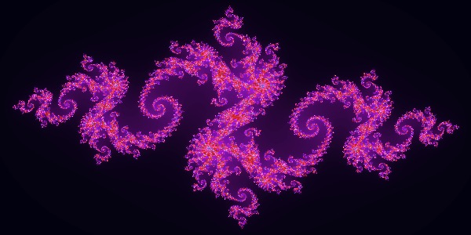
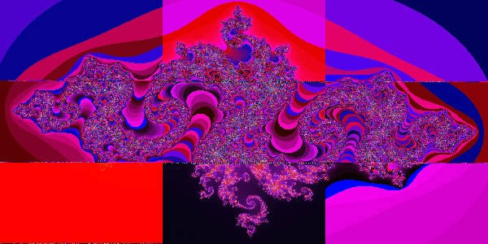

# SimGrid
A repository to learn about SimGrid, MPI, Distributed Applications and more.

### Tutorial

https://simgrid.github.io/SMPI_CourseWare/

I'm following this tutorial to learn about SimGrid, SMPI and more.

### Julia Set

#### Sequential implementation

Compile and execute:

```bash
cd juliaset/
make sequential
./sequential N
```

Where **N** is a natural positve number that represents the height of the generated image.



#### 1-D distribution

Compile and execute:

```bash
cd juliaset/
make 1d
smpirun -np 10 -hostfile ./simple_cluster_hostfile.txt -platform ./simple_cluster.xml ./1D_parallel_julia N
```

Where **N** is a natural positve number that represents the height of the generated image. And also, **-np parameter** should be divisor of N.


#### 2-D distribution

Compile and execute:

```bash
cd juliaset/
make 2d
smpirun -np 9 -hostfile ./simple_cluster_hostfile.txt -platform ./simple_cluster.xml ./2D_parallel_julia N
```

Where **N** is a natural positve number that represents the height of the generated image. And also, the square root of the **-np parameter** should be divisor of N.



### License
MIT License. [Click here for more information.](LICENSE)
